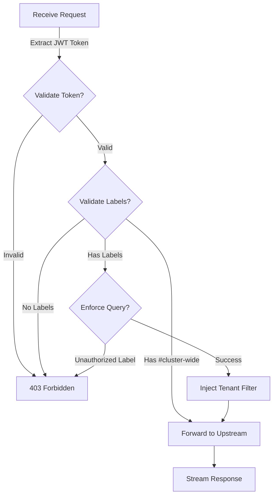

# LGTM LBAC Proxy

**Label-Based Access Control for the LGTM Stack** (Loki, Grafana, Tempo, Mimir/Prometheus)

[](https://goreportcard.com/report/github.com/binhnguyenduc/lgtm-lbac-proxy)
[](https://github.com/binhnguyenduc/lgtm-lbac-proxy/actions/workflows/release.yml)
[](https://godoc.org/github.com/binhnguyenduc/lgtm-lbac-proxy)
[](https://github.com/binhnguyenduc/lgtm-lbac-proxy/releases/latest)


---

## 📢 Notice

### Origin and Credits

This project is **based on** [multena-proxy](https://github.com/gepaplexx/multena-proxy) originally developed by **Gepardec**.

We extend our sincere gratitude to the Gepardec team for creating the foundational multi-tenancy proxy architecture that made this project possible. The original work established excellent patterns for label-based access control in observability stacks.

**Original Repository**: https://github.com/gepaplexx/multena-proxy

### Differences from Original

This repository has evolved as an **independent project** with a specific focus on the LGTM stack:

| Aspect | Original (multena-proxy) | This Project (lgtm-lbac-proxy) |
|--------|--------------------------|--------------------------------|
| **Focus** | General multi-tenancy proxy | LGTM stack specialization |
| **Tempo Support** | ❌ Not implemented | ✅ Full TraceQL enforcement |
| **Branding** | Generic "multena" naming | LGTM-specific branding |
| **Repository** | Gepardec organization | Independent maintenance |
| **Development** | Upstream changes | LGTM-focused enhancements |
| **Target Users** | OpenShift/Thanos users | LGTM stack users |

**Key Enhancements:**
- ✅ **Grafana Tempo Support**: Full TraceQL query enforcement with tenant label injection
- ✅ **Complete LGTM Coverage**: Metrics (Prometheus/Mimir), Logs (Loki), and Traces (Tempo)
- ✅ **LGTM-Optimized**: Documentation, examples, and configurations tailored for LGTM deployments
- ✅ **Active Development**: Ongoing enhancements focused on LGTM stack integration

**Compatibility**: The core authorization logic, configuration format, and API remain compatible with the original design.

---

## Overview

**LGTM LBAC Proxy** is a multi-tenancy authorization proxy designed specifically for the LGTM observability stack. Built with Label-Based Access Control (LBAC) at its core, it ensures secure and granular access to your observability data.

The proxy intercepts queries to Prometheus/Thanos, Loki, and Tempo, validates JWT tokens, enforces tenant label restrictions, and forwards authorized queries to upstream servers.

### Key Features

| Feature | Description |
|---------|-------------|
| **LGTM Stack Coverage** | Complete support for Metrics (Prometheus/Thanos/Mimir), Logs (Loki), and Traces (Tempo) |
| **Label-Based Access Control** | Fine-grained access control based on tenant labels (namespace, team, environment, etc.) |
| **JWT Authentication** | Secure authentication via OAuth/OIDC with JWKS validation |
| **File-Based Label Store** | Simple and portable ConfigMap/file-based label storage |
| **Query Enforcement** | Automatic injection of tenant filters into PromQL, LogQL, and TraceQL queries |
| **Admin Bypass** | Optional admin group with cluster-wide access |
| **Multi-Tenant Support** | Single user can access multiple tenant namespaces |
| **Secure Communication** | mTLS support for upstream connections |

### Currently Supported

- ✅ **Metrics**: Prometheus, Thanos, Mimir (PromQL enforcement)
- ✅ **Logging**: Loki (LogQL enforcement)
- ✅ **Traces**: Tempo (TraceQL enforcement) 🆕
- ⏳ **Profiles**: Planned for future release

---

## How It Works



**Authorization Flow:**

1. **Request Reception**: Proxy receives a query request (PromQL, LogQL, or TraceQL)
2. **JWT Validation**: Extracts and validates JWT token from Authorization header
3. **Label Retrieval**: Fetches allowed tenant labels for user/groups from label store
4. **Admin Bypass Check**: Users with `#cluster-wide` label skip enforcement
5. **Query Parsing**: Parses query using appropriate parser (PromQL/LogQL/TraceQL)
6. **Label Validation**: Checks if existing tenant labels in query are authorized
7. **Label Injection**: Injects tenant label filters if missing (e.g., `{namespace="prod"}`)
8. **Proxy Forward**: Forwards modified query to upstream (Prometheus/Loki/Tempo)
9. **Response Stream**: Streams response back to client

---

## Quick Start

### Binary

```bash
# Download latest release
wget https://github.com/binhnguyenduc/lgtm-lbac-proxy/releases/latest/download/lgtm-lbac-proxy

# Make executable
chmod +x lgtm-lbac-proxy

# Run with config
./lgtm-lbac-proxy
```

### Docker

```bash
docker run -d \
  -p 8080:8080 \
  -p 8081:8081 \
  -v $(pwd)/configs:/etc/config/config:ro \
  ghcr.io/binhnguyenduc/lgtm-lbac-proxy:latest
```

### Kubernetes (Helm)

```bash
# Install from local chart
helm install lgtm-lbac-proxy ./helm/lgtm-lbac-proxy \
  --namespace observability \
  --create-namespace \
  --set proxy.web.jwksCertUrl=https://your-oauth.com/certs \
  --set proxy.thanos.url=https://thanos-query:9091 \
  --set proxy.loki.url=https://loki-query:3100 \
  --set proxy.tempo.url=https://tempo-query:3200

# Create labels ConfigMap
kubectl create configmap lgtm-lbac-proxy-labels \
  --from-file=labels.yaml=./configs/labels.yaml \
  --namespace observability
```

See [Helm Chart Documentation](helm/lgtm-lbac-proxy/README.md) for detailed configuration options.

---

## Configuration

### Basic Configuration

Create `config.yaml`:

```yaml
# Authentication configuration
auth:
  jwks_cert_url: "https://your-oauth-provider.com/certs"
  auth_header: "Authorization"
  claims:
    username: "preferred_username"  # JWT claim for username
    email: "email"                   # JWT claim for email
    groups: "groups"                 # JWT claim for groups

admin:
  bypass: true
  group: "cluster-admins"

thanos:
  url: "https://thanos-querier:9091"
  tenant_label: "namespace"
  use_mutual_tls: false

loki:
  url: "https://loki-query-frontend:3100"
  tenant_label: "kubernetes_namespace_name"
  actor_header: "X-Loki-Actor"

tempo:
  url: "https://tempo-query-frontend:3100"
  tenant_label: "resource.namespace"
  actor_header: "X-Tempo-User"
```

### Configurable JWT Claims (New in v0.14.0)

Different OAuth providers use different claim names for user identity. You can now configure which JWT claims to use:

```yaml
auth:
  claims:
    username: "preferred_username"  # Keycloak, Okta
    # username: "unique_name"       # Azure AD
    # username: "nickname"          # Auth0
    # username: "email"             # Google

    email: "email"                  # Most providers
    # email: "upn"                  # Azure AD User Principal Name

    groups: "groups"                # Keycloak, Okta
    # groups: "roles"               # Azure AD
    # groups: "https://example.com/groups"  # Auth0 (namespaced)
```

**Common OAuth Providers:**

| Provider | Username | Email | Groups |
|----------|----------|-------|--------|
| **Keycloak** | `preferred_username` | `email` | `groups` |
| **Azure AD** | `unique_name`, `upn` | `email`, `upn` | `roles` |
| **Auth0** | `nickname`, `name` | `email` | `https://domain.com/groups` |
| **Google** | `email`, `sub` | `email` | `hd` (domain) |
| **Okta** | `preferred_username` | `email` | `groups` |

See [Configuration Examples](configs/examples/README.md) for provider-specific setup guides.

### Label Configuration

Create `labels.yaml` using the extended multi-label format:

```yaml
# User-specific labels with multi-label policies
alice@example.com:
  _rules:
    - name: namespace
      operator: '='
      values: ['prod', 'staging']
  _logic: AND

bob@example.com:
  _rules:
    - name: namespace
      operator: '='
      values: ['dev']
  _logic: AND

# Group-based labels
engineering-team:
  _rules:
    - name: namespace
      operator: '='
      values: ['prod', 'staging', 'dev']
  _logic: AND

# Admin access (cluster-wide bypass)
cluster-admins:
  _rules:
    - name: '#cluster-wide'
      operator: '='
      values: ['true']
  _logic: AND
```

**Extended Format Features:**
- **Multi-label support**: Enforce multiple labels simultaneously (e.g., namespace AND team)
- **Operators**: `=` (exact), `!=` (not equal), `=~` (regex), `!~` (negative regex)
- **Logic**: `AND` (all rules must match) or `OR` (any rule can match)

**Example - Multi-label Policy:**
```yaml
# Enforce both namespace and team labels
user@example.com:
  _rules:
    - name: namespace
      operator: '='
      values: ['prod']
    - name: team
      operator: '=~'
      values: ['backend.*']
  _logic: AND  # Both conditions must be satisfied
```

### Migration from MySQL Label Store

If you're upgrading from a version that used MySQL label store:

**Step 1: Export labels from MySQL**
```sql
-- Export user labels
SELECT username, allowed_labels FROM label_mappings;
```

**Step 2: Convert to extended format**

Create `labels.yaml` using the extended multi-label format:
```yaml
# Convert MySQL rows to extended format
username1:
  _rules:
    - name: namespace
      operator: '='
      values: ['namespace1', 'namespace2']
  _logic: AND

group1:
  _rules:
    - name: namespace
      operator: '='
      values: ['namespace3']
  _logic: AND
```

**Step 3: Update configuration**
Remove these fields from `config.yaml`:
- `web.label_store_kind` (no longer needed)
- `db:` section (entire section)

**Step 4: Deploy labels ConfigMap**
```bash
kubectl create configmap lgtm-lbac-proxy-labels \
  --from-file=labels.yaml=./labels.yaml \
  --namespace observability
```

**Note**: The label store now automatically uses file-based ConfigMap mode. For custom label store implementations (e.g., external databases, LDAP), see the `contrib/labelstores/` directory.

### Migration from Simple Format (v0.11 and earlier)

**BREAKING CHANGE in v0.12.0**: The simple label format has been removed. If you're upgrading from v0.11 or earlier, you must migrate to the extended format.

**Old Simple Format (DEPRECATED, removed in v0.12.0):**
```yaml
# ❌ This format is no longer supported
user@example.com:
  namespace1: true
  namespace2: true
```

**New Extended Format (REQUIRED as of v0.12.0):**
```yaml
# ✅ Use this format
user@example.com:
  _rules:
    - name: namespace
      operator: '='
      values: ['namespace1', 'namespace2']
  _logic: AND
```

**Migration Tool:**

A migration tool is provided to automatically convert simple format to extended format:

```bash
# Download the migration tool
wget https://github.com/binhnguyenduc/lgtm-lbac-proxy/releases/latest/download/migrate-labels

# Make it executable
chmod +x migrate-labels

# Convert your labels file
./migrate-labels -input labels.yaml -output labels-extended.yaml -tenant-label namespace

# Verify the output
cat labels-extended.yaml

# Deploy the new format
kubectl create configmap lgtm-lbac-proxy-labels \
  --from-file=labels.yaml=./labels-extended.yaml \
  --namespace observability \
  --dry-run=client -o yaml | kubectl apply -f -
```

**Migration Steps:**

1. **Backup**: Save your current `labels.yaml`
2. **Convert**: Use the migration tool to convert to extended format
3. **Test**: Validate the new format works in a test environment
4. **Deploy**: Update your ConfigMap with the new format
5. **Upgrade**: Deploy v0.12.0+ with the extended format

**Why This Change?**

The extended format provides:
- **Multi-label enforcement**: Support for complex policies (namespace AND team)
- **Flexible operators**: Exact match, regex, negation
- **Logical combinations**: AND/OR logic for rules
- **Future-proof**: Foundation for advanced RBAC features

---

## Query Examples

### Metrics (PromQL)

**Before (Original Query)**:
```promql
rate(http_requests_total[5m])
```

**After (Enforced)**:
```promql
rate(http_requests_total{namespace="prod"}[5m])
```

### Logs (LogQL)

**Before (Original Query)**:
```logql
{app="nginx"} |= "error"
```

**After (Enforced)**:
```logql
{kubernetes_namespace_name="prod",app="nginx"} |= "error"
```

### Traces (TraceQL) 🆕

**Before (Original Query)**:
```traceql
{ span.http.status_code >= 500 }
```

**After (Enforced)**:
```traceql
{ resource.namespace="prod" && span.http.status_code >= 500 }
```

---

## Kubernetes Deployment

### Helm Chart

The project includes a production-ready Helm chart for Kubernetes deployment.

**Chart Version**: 1.8.0 | **App Version**: 0.7.0

#### Features

- ✅ **Complete LGTM Stack**: Full support for Prometheus/Thanos, Loki, and Tempo
- ✅ **Production Ready**: Resource limits, security contexts, health probes, HPA
- ✅ **Security Hardened**: Non-root execution, dropped capabilities, seccomp profiles
- ✅ **Auto-scaling**: Horizontal Pod Autoscaler with CPU/memory metrics
- ✅ **Monitoring**: ServiceMonitor for Prometheus metrics collection
- ✅ **Vanilla Kubernetes**: No platform-specific dependencies

#### Quick Installation

```bash
# Install the chart
helm install lgtm-lbac-proxy ./helm/lgtm-lbac-proxy \
  --namespace observability \
  --create-namespace \
  --set proxy.web.jwksCertUrl=https://oauth.example.com/certs \
  --set proxy.thanos.url=https://thanos-querier.monitoring.svc:9091 \
  --set proxy.loki.url=https://loki-query-frontend.logging.svc:3100 \
  --set proxy.tempo.url=https://tempo-query-frontend.tracing.svc:3200

# Create labels ConfigMap
cat <<EOF | kubectl apply -f -
apiVersion: v1
kind: ConfigMap
metadata:
  name: lgtm-lbac-proxy-labels
  namespace: observability
data:
  labels.yaml: |
    alice@example.com:
      _rules:
        - name: namespace
          operator: '='
          values: ['prod', 'staging']
      _logic: AND
    admin-group:
      _rules:
        - name: '#cluster-wide'
          operator: '='
          values: ['true']
      _logic: AND
EOF
```

#### Configuration Examples

**Minimal Production:**
```yaml
# values.yaml
replicas: 2

resources:
  requests:
    cpu: 100m
    memory: 128Mi
  limits:
    cpu: 500m
    memory: 256Mi

proxy:
  web:
    jwksCertUrl: https://oauth.example.com/certs
  thanos:
    url: https://thanos-querier.monitoring.svc:9091
  loki:
    url: https://loki-query-frontend.logging.svc:3100
  tempo:
    url: https://tempo-query-frontend.tracing.svc:3200
```

**High Availability:**
```yaml
replicas: 3

autoscaling:
  enabled: true
  minReplicas: 3
  maxReplicas: 10
  targetCPUUtilizationPercentage: 70

proxy:
  topologySpreadConstraints:
    - maxSkew: 1
      topologyKey: topology.kubernetes.io/zone
      whenUnsatisfiable: DoNotSchedule
```

For complete configuration options and deployment examples, see:
- [Helm Chart README](helm/lgtm-lbac-proxy/README.md)
- [Helm Chart CHANGELOG](helm/lgtm-lbac-proxy/CHANGELOG.md)

---

## Datasource Configuration

### Grafana Configuration

Configure Grafana datasources to point to the proxy:

**Prometheus/Thanos:**
```
URL: http://lgtm-lbac-proxy:8080/api/v1
```

**Loki:**
```
URL: http://lgtm-lbac-proxy:8080/loki/api/v1
```

**Tempo:**
```
URL: http://lgtm-lbac-proxy:8080/tempo/api
```

All requests must include valid JWT token in Authorization header.

---

## Building from Source

```bash
# Clone repository
git clone https://github.com/binhnguyenduc/lgtm-lbac-proxy.git
cd lgtm-lbac-proxy

# Build binary
make build

# Run tests
make test

# Build Docker image
make docker-build-full
```

See [BUILD.md](BUILD.md) for detailed build instructions.

---

## Migration from multena-proxy

If you're migrating from the original multena-proxy, see [MIGRATION.md](MIGRATION.md) for a comprehensive guide.

**Key Changes:**
- Binary name: `multena-proxy` → `lgtm-lbac-proxy`
- Docker image: `ghcr.io/gepaplexx/multena-proxy` → `ghcr.io/binhnguyenduc/lgtm-lbac-proxy`
- Helm chart: `gp-multena` → `lgtm-lbac-proxy`

**No breaking changes** to configuration format or API endpoints.

---

## Documentation

- [Configuration Guide](configs/config.yaml)
- [Build Instructions](BUILD.md)
- [Migration Guide](MIGRATION.md)
- [Helm Chart README](helm/lgtm-lbac-proxy/README.md)
- [Helm Chart CHANGELOG](helm/lgtm-lbac-proxy/CHANGELOG.md)

---

## Contributing

Contributions are welcome! This is an independent project focused on LGTM stack support.

1. Fork the repository
2. Create a feature branch
3. Make your changes
4. Submit a pull request

---

## License

This project is licensed under the GNU Affero General Public License v3.0 - see the [LICENSE](LICENSE) file for details.

---

## Acknowledgments

- **Original Project**: [multena-proxy](https://github.com/gepaplexx/multena-proxy) by Gepardec
- **Contributors**: Thank you to everyone who has contributed to making LGTM stack observability more secure

---

## Support

- **Issues**: [GitHub Issues](https://github.com/binhnguyenduc/lgtm-lbac-proxy/issues)
- **Discussions**: [GitHub Discussions](https://github.com/binhnguyenduc/lgtm-lbac-proxy/discussions)
- **Documentation**: [GitHub Wiki](https://github.com/binhnguyenduc/lgtm-lbac-proxy/wiki)
