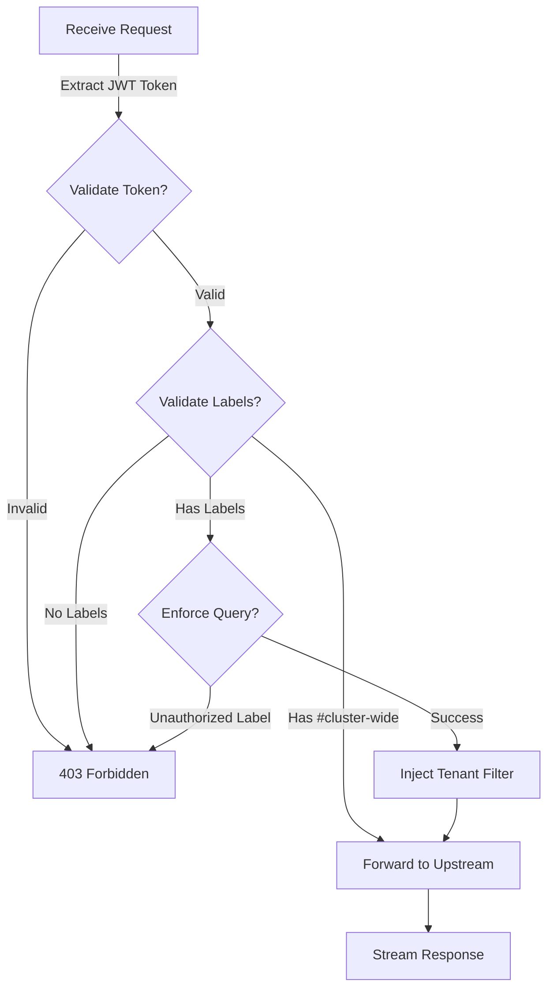

# LGTM LBAC Proxy

**Label-Based Access Control for the LGTM Stack** (Loki, Grafana, Tempo, Mimir/Prometheus)

[](https://goreportcard.com/report/github.com/binhnguyenduc/lgtm-lbac-proxy)
[](https://github.com/binhnguyenduc/lgtm-lbac-proxy/actions/workflows/release.yml)
[](https://godoc.org/github.com/binhnguyenduc/lgtm-lbac-proxy)
[](https://github.com/binhnguyenduc/lgtm-lbac-proxy/releases/latest)


---

## 📢 Notice

### Origin and Acknowledgments

This project originated from [multena-proxy](https://github.com/gepaplexx/multena-proxy) by **Gepardec**, which provided the foundational architecture for multi-tenancy proxy with label-based access control.

**Original Repository**: https://github.com/gepaplexx/multena-proxy

We extend our sincere gratitude to the Gepardec team for their pioneering work in bringing label-based access control to observability stacks. Their original implementation established excellent patterns that influenced our approach.

### Why an Independent Project?

**LGTM LBAC Proxy** has evolved as an **independent project** with significant architectural changes and new capabilities that go beyond the original scope:

#### Core Philosophy Differences

| Aspect | Original (multena-proxy) | This Project (lgtm-lbac-proxy) |
|--------|--------------------------|--------------------------------|
| **Target Stack** | OpenShift + Thanos/Loki | Complete LGTM stack (L+G+T+M) |
| **Tracing Support** | ❌ Not implemented | ✅ Full TraceQL enforcement |
| **Label Model** | Single-label per user | Multi-label policies with operators |
| **Label Storage** | MySQL + ConfigMap | File-based (ConfigMap) only |
| **Configuration** | Fixed auth claims | Configurable JWT claims for any OAuth provider |
| **Performance** | Standard reverse proxy | Optimized with connection pooling (1000-2000 req/s) |
| **Architecture** | Simple label mappings | Policy-based with AND/OR logic |
| **Development** | Upstream maintenance | Independent feature development |

#### Major Enhancements & Breaking Changes

**New Capabilities** (not in original):
- ✅ **Grafana Tempo Integration**: Complete TraceQL query enforcement with resource attribute injection
- ✅ **Multi-Label Enforcement**: Support multiple labels per user (namespace AND team AND environment)
- ✅ **Flexible Operators**: Exact match (`=`), regex (`=~`), negation (`!=`, `!~`)
- ✅ **Policy Logic**: AND/OR combinations for complex access rules
- ✅ **Configurable JWT Claims**: Support any OAuth provider (Keycloak, Azure AD, Auth0, Google, Okta)
- ✅ **High-Performance Proxy**: Dedicated transports with connection pooling and per-upstream tuning
- ✅ **Production Helm Chart**: Full Kubernetes deployment with HPA, security contexts, and ServiceMonitor

**Architectural Changes** (breaking compatibility):
- 🔄 **Removed MySQL Label Store**: File-based ConfigMap only (v0.9.0)
- 🔄 **Removed Simple Label Format**: Extended format with `_rules`/`_logic` required (v0.12.0)
- 🔄 **New Label Store Interface**: `GetLabelPolicy()` instead of `GetLabels()`
- 🔄 **Policy-Based Enforcement**: Rules and operators instead of simple key-value labels

#### When to Use Each Project

**Use multena-proxy** if you need:
- OpenShift-specific integrations
- Simple single-label enforcement (namespace only)
- MySQL label storage
- Minimal changes to existing deployments

**Use lgtm-lbac-proxy** if you need:
- Complete LGTM stack support (Loki + Grafana + Tempo + Mimir)
- Distributed tracing with Grafana Tempo
- Multi-label policies (namespace + team + environment)
- High-throughput production deployment (1000+ req/s)
- Flexible OAuth provider integration
- Advanced access control with regex and negation

### Compatibility Notice

**⚠️ Not a Drop-In Replacement**: This project has diverged significantly from multena-proxy with breaking changes:
- Configuration format changes (extended label format required)
- Different label storage mechanism (no MySQL support)
- New authentication configuration structure

Migration from multena-proxy requires configuration updates. See [MIGRATION.md](MIGRATION.md) for detailed instructions.

---

## Overview

**LGTM LBAC Proxy** is a multi-tenancy authorization proxy designed specifically for the LGTM observability stack. Built with Label-Based Access Control (LBAC) at its core, it ensures secure and granular access to your observability data.

The proxy intercepts queries to Prometheus/Thanos, Loki, and Tempo, validates JWT tokens, enforces tenant label restrictions, and forwards authorized queries to upstream servers.

### Key Features

| Feature | Description |
|---------|-------------|
| **Complete LGTM Stack** | Full support for Metrics (Prometheus/Thanos/Mimir), Logs (Loki), and Traces (Tempo) |
| **Multi-Label Policies** | Enforce multiple labels per user with AND/OR logic (namespace AND team AND environment) |
| **Flexible Operators** | Support for exact (`=`), regex (`=~`), not-equal (`!=`), and negative regex (`!~`) matching |
| **Configurable JWT Claims** | Compatible with any OAuth provider - configure username, email, and groups claims |
| **High-Performance Proxy** | Handle 1000-2000 req/s with connection pooling and per-upstream optimization |
| **Query Enforcement** | Automatic injection of tenant filters into PromQL, LogQL, and TraceQL queries |
| **TraceQL Support** | Full distributed tracing support with Grafana Tempo integration |
| **File-Based Label Store** | Simple and portable ConfigMap/file-based label storage (no database required) |
| **Admin Bypass** | Optional admin group with `#cluster-wide` access for unrestricted queries |
| **Production-Ready Helm Chart** | Kubernetes deployment with HPA, security contexts, and ServiceMonitor |
| **Secure Communication** | JWT/JWKS authentication with mTLS support for upstream connections |
| **OAuth Provider Support** | Pre-configured examples for Keycloak, Azure AD, Auth0, Google, and Okta |

### Currently Supported

- ✅ **Metrics**: Prometheus, Thanos, Mimir (PromQL enforcement)
- ✅ **Logging**: Loki (LogQL enforcement)
- ✅ **Traces**: Tempo (TraceQL enforcement) 🆕
- ⏳ **Profiles**: Planned for future release

---

## How It Works



**Authorization Flow:**

1. **Request Reception**: Proxy receives a query request (PromQL, LogQL, or TraceQL)
2. **JWT Validation**: Extracts and validates JWT token from Authorization header
3. **Label Retrieval**: Fetches allowed tenant labels for user/groups from label store
4. **Admin Bypass Check**: Users with `#cluster-wide` label skip enforcement
5. **Query Parsing**: Parses query using appropriate parser (PromQL/LogQL/TraceQL)
6. **Label Validation**: Checks if existing tenant labels in query are authorized
7. **Label Injection**: Injects tenant label filters if missing (e.g., `{namespace="prod"}`)
8. **Proxy Forward**: Forwards modified query to upstream (Prometheus/Loki/Tempo)
9. **Response Stream**: Streams response back to client

---

## Quick Start

### Binary

```bash
# Download latest release
wget https://github.com/binhnguyenduc/lgtm-lbac-proxy/releases/latest/download/lgtm-lbac-proxy

# Make executable
chmod +x lgtm-lbac-proxy

# Run with config
./lgtm-lbac-proxy
```

### Docker

```bash
docker run -d \
  -p 8080:8080 \
  -p 8081:8081 \
  -v $(pwd)/configs:/etc/config/config:ro \
  ghcr.io/binhnguyenduc/lgtm-lbac-proxy:latest
```

### Kubernetes (Helm)

```bash
# Install from local chart
helm install lgtm-lbac-proxy ./helm/lgtm-lbac-proxy \
  --namespace observability \
  --create-namespace \
  --set proxy.web.jwksCertUrl=https://your-oauth.com/certs \
  --set proxy.thanos.url=https://thanos-query:9091 \
  --set proxy.loki.url=https://loki-query:3100 \
  --set proxy.tempo.url=https://tempo-query:3200

# Create labels ConfigMap
kubectl create configmap lgtm-lbac-proxy-labels \
  --from-file=labels.yaml=./configs/labels.yaml \
  --namespace observability
```

See [Helm Chart Documentation](helm/lgtm-lbac-proxy/README.md) for detailed configuration options.

---

## Configuration

### Basic Configuration

Create `config.yaml`:

```yaml
# Authentication configuration
auth:
  jwks_cert_url: "https://your-oauth-provider.com/certs"
  auth_header: "Authorization"
  claims:
    username: "preferred_username"  # JWT claim for username
    email: "email"                   # JWT claim for email
    groups: "groups"                 # JWT claim for groups

admin:
  bypass: true
  group: "cluster-admins"

thanos:
  url: "https://thanos-querier:9091"
  tenant_label: "namespace"
  use_mutual_tls: false

loki:
  url: "https://loki-query-frontend:3100"
  tenant_label: "kubernetes_namespace_name"
  actor_header: "X-Loki-Actor"

tempo:
  url: "https://tempo-query-frontend:3100"
  tenant_label: "resource.namespace"
  actor_header: "X-Tempo-User"
```

### Configurable JWT Claims (New in v0.14.0)

Different OAuth providers use different claim names for user identity. You can now configure which JWT claims to use:

```yaml
auth:
  claims:
    username: "preferred_username"  # Keycloak, Okta
    # username: "unique_name"       # Azure AD
    # username: "nickname"          # Auth0
    # username: "email"             # Google

    email: "email"                  # Most providers
    # email: "upn"                  # Azure AD User Principal Name

    groups: "groups"                # Keycloak, Okta
    # groups: "roles"               # Azure AD
    # groups: "https://example.com/groups"  # Auth0 (namespaced)
```

**Common OAuth Providers:**

| Provider | Username | Email | Groups |
|----------|----------|-------|--------|
| **Keycloak** | `preferred_username` | `email` | `groups` |
| **Azure AD** | `unique_name`, `upn` | `email`, `upn` | `roles` |
| **Auth0** | `nickname`, `name` | `email` | `https://domain.com/groups` |
| **Google** | `email`, `sub` | `email` | `hd` (domain) |
| **Okta** | `preferred_username` | `email` | `groups` |

See [Configuration Examples](configs/examples/README.md) for provider-specific setup guides.

### High-Performance Proxy Configuration (New in v0.13.0)

Configure proxy performance settings for high-throughput deployments:

```yaml
# Global proxy defaults (optional - sensible defaults provided)
proxy:
  request_timeout: 60s          # Maximum request duration
  idle_conn_timeout: 90s        # Keep-alive for idle connections
  tls_handshake_timeout: 10s    # TLS handshake timeout
  max_idle_conns: 500           # Total idle connections across all upstreams
  max_idle_conns_per_host: 100  # Idle connections per upstream
  force_http2: true             # Enable HTTP/2 when available

# Per-upstream overrides (customize for workload characteristics)
loki:
  url: "https://loki-query-frontend:3100"
  tenant_label: "kubernetes_namespace_name"
  proxy:
    request_timeout: 120s        # Log queries can be slow
    max_idle_conns_per_host: 150 # High log volume needs more connections

tempo:
  url: "https://tempo-query-frontend:3100"
  tenant_label: "resource.namespace"
  proxy:
    request_timeout: 300s        # Trace queries need longer timeout
    max_idle_conns_per_host: 50  # Lower volume, fewer connections

thanos:
  url: "https://thanos-querier:9091"
  tenant_label: "namespace"
  proxy:
    request_timeout: 60s
    max_idle_conns_per_host: 100
```

**Performance Characteristics:**
- **Throughput**: 1000-2000 req/s with connection pooling
- **Connection Reuse**: >95% under steady load
- **Latency Impact**: <1 µs added per request (negligible)
- **Configuration Precedence**: `upstream-specific > global > built-in defaults`

**When to Tune:**
- **High request rate** (>500 req/s): Increase `max_idle_conns_per_host`
- **Slow queries**: Increase `request_timeout` for specific upstream
- **HTTP/2 capable upstreams**: Enable `force_http2` for multiplexing
- **Connection exhaustion**: Increase `max_idle_conns` total pool size

### Label Configuration

Create `labels.yaml` using the extended multi-label format (required as of v0.12.0):

```yaml
# Simple single-label policy
alice@example.com:
  _rules:
    - name: namespace
      operator: '='
      values: ['prod', 'staging']
  _logic: AND

# Multi-label policy with AND logic
bob@example.com:
  _rules:
    - name: namespace
      operator: '='
      values: ['prod']
    - name: team
      operator: '=~'
      values: ['backend.*']
    - name: environment
      operator: '!='
      values: ['test']
  _logic: AND  # All three conditions must be satisfied

# Multi-label policy with OR logic
charlie@example.com:
  _rules:
    - name: namespace
      operator: '='
      values: ['dev']
    - name: namespace
      operator: '='
      values: ['staging']
  _logic: OR  # Either dev OR staging

# Regex matching for complex patterns
engineering-team:
  _rules:
    - name: namespace
      operator: '=~'
      values: ['prod-.*', 'staging-.*']  # Matches prod-app1, staging-db, etc.
    - name: team
      operator: '='
      values: ['engineering']
  _logic: AND

# Admin access (cluster-wide bypass)
cluster-admins:
  _rules:
    - name: '#cluster-wide'
      operator: '='
      values: ['true']
  _logic: AND
```

**Extended Format Features:**
- **Multi-label enforcement**: Combine multiple labels with AND/OR logic (e.g., namespace AND team AND environment)
- **Rich operators**:
  - `=` - Exact match
  - `!=` - Not equal (negation)
  - `=~` - Regex match (e.g., `backend.*` matches backend-api, backend-worker)
  - `!~` - Negative regex (exclude patterns)
- **Logical combinations**:
  - `AND` - All rules must be satisfied (default)
  - `OR` - Any rule can be satisfied
- **Per-user policies**: Different users can have completely different label enforcement rules

**Real-World Examples:**

```yaml
# Backend team: only prod namespace + backend services
backend-developers:
  _rules:
    - name: namespace
      operator: '='
      values: ['prod']
    - name: service
      operator: '=~'
      values: ['backend-.*', 'api-.*']
  _logic: AND

# QA team: staging and test environments, but not production
qa-team:
  _rules:
    - name: environment
      operator: '='
      values: ['staging', 'test']
    - name: environment
      operator: '!='
      values: ['production']
  _logic: AND

# Multi-region access: only specific regions
us-team:
  _rules:
    - name: region
      operator: '='
      values: ['us-east-1', 'us-west-2']
  _logic: OR

# Cost center tracking with exclusions
finance-team:
  _rules:
    - name: cost_center
      operator: '='
      values: ['finance']
    - name: namespace
      operator: '!~'
      values: ['temp-.*', 'test-.*']  # Exclude temporary/test namespaces
  _logic: AND
```

### Migration from MySQL Label Store

If you're upgrading from a version that used MySQL label store:

**Step 1: Export labels from MySQL**
```sql
-- Export user labels
SELECT username, allowed_labels FROM label_mappings;
```

**Step 2: Convert to extended format**

Create `labels.yaml` using the extended multi-label format:
```yaml
# Convert MySQL rows to extended format
username1:
  _rules:
    - name: namespace
      operator: '='
      values: ['namespace1', 'namespace2']
  _logic: AND

group1:
  _rules:
    - name: namespace
      operator: '='
      values: ['namespace3']
  _logic: AND
```

**Step 3: Update configuration**
Remove these fields from `config.yaml`:
- `web.label_store_kind` (no longer needed)
- `db:` section (entire section)

**Step 4: Deploy labels ConfigMap**
```bash
kubectl create configmap lgtm-lbac-proxy-labels \
  --from-file=labels.yaml=./labels.yaml \
  --namespace observability
```

**Note**: The label store now automatically uses file-based ConfigMap mode. For custom label store implementations (e.g., external databases, LDAP), see the `contrib/labelstores/` directory.

### Migration from Simple Format (v0.11 and earlier)

**BREAKING CHANGE in v0.12.0**: The simple label format has been removed. If you're upgrading from v0.11 or earlier, you must migrate to the extended format.

**Old Simple Format (DEPRECATED, removed in v0.12.0):**
```yaml
# ❌ This format is no longer supported
user@example.com:
  namespace1: true
  namespace2: true
```

**New Extended Format (REQUIRED as of v0.12.0):**
```yaml
# ✅ Use this format
user@example.com:
  _rules:
    - name: namespace
      operator: '='
      values: ['namespace1', 'namespace2']
  _logic: AND
```

**Migration Tool:**

A migration tool is provided to automatically convert simple format to extended format:

```bash
# Download the migration tool
wget https://github.com/binhnguyenduc/lgtm-lbac-proxy/releases/latest/download/migrate-labels

# Make it executable
chmod +x migrate-labels

# Convert your labels file
./migrate-labels -input labels.yaml -output labels-extended.yaml -tenant-label namespace

# Verify the output
cat labels-extended.yaml

# Deploy the new format
kubectl create configmap lgtm-lbac-proxy-labels \
  --from-file=labels.yaml=./labels-extended.yaml \
  --namespace observability \
  --dry-run=client -o yaml | kubectl apply -f -
```

**Migration Steps:**

1. **Backup**: Save your current `labels.yaml`
2. **Convert**: Use the migration tool to convert to extended format
3. **Test**: Validate the new format works in a test environment
4. **Deploy**: Update your ConfigMap with the new format
5. **Upgrade**: Deploy v0.12.0+ with the extended format

**Why This Change?**

The extended format provides:
- **Multi-label enforcement**: Support for complex policies (namespace AND team)
- **Flexible operators**: Exact match, regex, negation
- **Logical combinations**: AND/OR logic for rules
- **Future-proof**: Foundation for advanced RBAC features

---

## Query Examples

### Single-Label Enforcement

#### Metrics (PromQL)

**User Policy**: `namespace="prod"`

```promql
# Original Query
rate(http_requests_total[5m])

# Enforced Query
rate(http_requests_total{namespace="prod"}[5m])
```

#### Logs (LogQL)

**User Policy**: `kubernetes_namespace_name="prod"`

```logql
# Original Query
{app="nginx"} |= "error"

# Enforced Query
{kubernetes_namespace_name="prod",app="nginx"} |= "error"
```

#### Traces (TraceQL)

**User Policy**: `resource.namespace="prod"`

```traceql
# Original Query
{ span.http.status_code >= 500 }

# Enforced Query
{ resource.namespace="prod" && span.http.status_code >= 500 }
```

### Multi-Label Enforcement (New in v0.10.0)

#### Complex PromQL Query

**User Policy**: `namespace="prod" AND team=~"backend.*" AND environment!="test"`

```promql
# Original Query
sum(rate(http_requests_total[5m])) by (service)

# Enforced Query
sum(rate(http_requests_total{namespace="prod",team=~"backend.*",environment!="test"}[5m])) by (service)
```

#### Multi-Label LogQL

**User Policy**: `namespace="prod" AND service=~"api-.*"`

```logql
# Original Query
{job="kubernetes-pods"} | json | line_format "{{.message}}"

# Enforced Query
{namespace="prod",service=~"api-.*",job="kubernetes-pods"} | json | line_format "{{.message}}"
```

#### Multi-Label TraceQL

**User Policy**: `resource.namespace="prod" AND resource.team="backend"`

```traceql
# Original Query
{ duration > 1s && span.http.status_code = 500 }

# Enforced Query
{ resource.namespace="prod" && resource.team="backend" && duration > 1s && span.http.status_code = 500 }
```

### Regex and Negation Examples

#### Regex Match Operator (`=~`)

**User Policy**: `namespace=~"prod-.*"`  (matches prod-app1, prod-db, etc.)

```promql
# Enforced Query
rate(http_requests_total{namespace=~"prod-.*"}[5m])
```

#### Negation Operator (`!=`)

**User Policy**: `environment!="test"`  (exclude test environment)

```logql
# Enforced Query
{environment!="test",app="nginx"} |= "error"
```

#### Negative Regex (`!~`)

**User Policy**: `namespace!~"temp-.*"`  (exclude temporary namespaces)

```promql
# Enforced Query
sum(container_memory_usage_bytes{namespace!~"temp-.*"}) by (pod)
```

---

## Kubernetes Deployment

### Helm Chart

The project includes a production-ready Helm chart for Kubernetes deployment.

**Chart Version**: 1.8.0+ | **App Version**: 0.14.0

#### Features

- ✅ **Complete LGTM Stack**: Full support for Prometheus/Thanos, Loki, and Tempo
- ✅ **Multi-Label Policies**: Advanced access control with AND/OR logic and operators
- ✅ **High Performance**: Connection pooling and per-upstream optimization (1000-2000 req/s)
- ✅ **Configurable Auth**: Support for Keycloak, Azure AD, Auth0, Google, Okta
- ✅ **Production Ready**: Resource limits, security contexts, health probes, HPA
- ✅ **Security Hardened**: Non-root execution, dropped capabilities, seccomp profiles
- ✅ **Auto-scaling**: Horizontal Pod Autoscaler with CPU/memory metrics
- ✅ **Monitoring**: ServiceMonitor for Prometheus metrics collection
- ✅ **Vanilla Kubernetes**: No platform-specific dependencies

#### Quick Installation

```bash
# Install the chart with new auth configuration (v0.14.0+)
helm install lgtm-lbac-proxy ./helm/lgtm-lbac-proxy \
  --namespace observability \
  --create-namespace \
  --set proxy.auth.jwksCertUrl=https://oauth.example.com/certs \
  --set proxy.auth.claims.username=preferred_username \
  --set proxy.auth.claims.email=email \
  --set proxy.auth.claims.groups=groups \
  --set proxy.thanos.url=https://thanos-querier.monitoring.svc:9091 \
  --set proxy.loki.url=https://loki-query-frontend.logging.svc:3100 \
  --set proxy.tempo.url=https://tempo-query-frontend.tracing.svc:3200

# Create labels ConfigMap with extended format
cat <<EOF | kubectl apply -f -
apiVersion: v1
kind: ConfigMap
metadata:
  name: lgtm-lbac-proxy-labels
  namespace: observability
data:
  labels.yaml: |
    # Single-label policy
    alice@example.com:
      _rules:
        - name: namespace
          operator: '='
          values: ['prod', 'staging']
      _logic: AND

    # Multi-label policy with regex
    backend-team:
      _rules:
        - name: namespace
          operator: '='
          values: ['prod']
        - name: team
          operator: '=~'
          values: ['backend-.*']
      _logic: AND

    # Admin with cluster-wide access
    admin-group:
      _rules:
        - name: '#cluster-wide'
          operator: '='
          values: ['true']
      _logic: AND
EOF
```

#### Configuration Examples

**Minimal Production (v0.14.0+):**
```yaml
# values.yaml
replicas: 2

resources:
  requests:
    cpu: 100m
    memory: 128Mi
  limits:
    cpu: 500m
    memory: 256Mi

proxy:
  # New auth configuration (v0.14.0+)
  auth:
    jwksCertUrl: https://oauth.example.com/certs
    claims:
      username: preferred_username
      email: email
      groups: groups

  # Upstream configuration
  thanos:
    url: https://thanos-querier.monitoring.svc:9091
    tenantLabel: namespace
  loki:
    url: https://loki-query-frontend.logging.svc:3100
    tenantLabel: kubernetes_namespace_name
  tempo:
    url: https://tempo-query-frontend.tracing.svc:3200
    tenantLabel: resource.namespace
```

**High Availability with Performance Tuning:**
```yaml
replicas: 3

# HPA for auto-scaling
autoscaling:
  enabled: true
  minReplicas: 3
  maxReplicas: 10
  targetCPUUtilizationPercentage: 70
  targetMemoryUtilizationPercentage: 80

# Resource limits for high throughput
resources:
  requests:
    cpu: 500m
    memory: 512Mi
  limits:
    cpu: 2000m
    memory: 1Gi

proxy:
  auth:
    jwksCertUrl: https://oauth.example.com/certs
    claims:
      username: preferred_username
      email: email
      groups: groups

  # Global proxy performance settings (v0.13.0+)
  proxyConfig:
    request_timeout: 60s
    max_idle_conns: 500
    max_idle_conns_per_host: 100
    idle_conn_timeout: 90s
    force_http2: true

  # Per-upstream tuning
  loki:
    url: https://loki-query-frontend.logging.svc:3100
    tenantLabel: kubernetes_namespace_name
    proxy:
      request_timeout: 120s
      max_idle_conns_per_host: 150

  tempo:
    url: https://tempo-query-frontend.tracing.svc:3200
    tenantLabel: resource.namespace
    proxy:
      request_timeout: 300s
      max_idle_conns_per_host: 50

  # Topology spread for high availability
  topologySpreadConstraints:
    - maxSkew: 1
      topologyKey: topology.kubernetes.io/zone
      whenUnsatisfiable: DoNotSchedule
```

**Azure AD Integration:**
```yaml
proxy:
  auth:
    jwksCertUrl: https://login.microsoftonline.com/YOUR_TENANT_ID/discovery/v2.0/keys
    claims:
      username: unique_name  # Azure AD specific
      email: upn            # User Principal Name
      groups: roles         # Azure AD uses 'roles' for groups
```

For complete configuration options and deployment examples, see:
- [Helm Chart README](helm/lgtm-lbac-proxy/README.md)
- [Helm Chart CHANGELOG](helm/lgtm-lbac-proxy/CHANGELOG.md)

---

## Datasource Configuration

### Grafana Configuration

Configure Grafana datasources to point to the proxy:

**Prometheus/Thanos:**
```
URL: http://lgtm-lbac-proxy:8080/api/v1
```

**Loki:**
```
URL: http://lgtm-lbac-proxy:8080/loki/api/v1
```

**Tempo:**
```
URL: http://lgtm-lbac-proxy:8080/tempo/api
```

All requests must include valid JWT token in Authorization header.

---

## Building from Source

```bash
# Clone repository
git clone https://github.com/binhnguyenduc/lgtm-lbac-proxy.git
cd lgtm-lbac-proxy

# Build binary
make build

# Run tests
make test

# Build Docker image
make docker-build-full
```

See [BUILD.md](BUILD.md) for detailed build instructions.

---

## Migration from multena-proxy

If you're migrating from the original multena-proxy, see [MIGRATION.md](MIGRATION.md) for a comprehensive guide.

### Naming Changes

- **Binary name**: `multena-proxy` → `lgtm-lbac-proxy`
- **Docker image**: `ghcr.io/gepaplexx/multena-proxy` → `ghcr.io/binhnguyenduc/lgtm-lbac-proxy`
- **Helm chart**: `gp-multena` → `lgtm-lbac-proxy`

### Breaking Changes Since Fork

⚠️ **Important**: This project has introduced breaking changes that require configuration updates:

1. **Label Format (v0.12.0)**: Simple label format removed
   - **Old**: `user: {namespace: true}`
   - **New**: Extended format with `_rules` and `_logic` required
   - **Migration**: Use `migrate-labels` tool to convert existing labels

2. **MySQL Label Store (v0.9.0)**: MySQL support removed
   - **Old**: `label_store_kind: mysql` with `db:` configuration
   - **New**: File-based ConfigMap only
   - **Migration**: Export MySQL data and convert to YAML format

3. **Authentication Configuration (v0.14.0)**: New auth section (backward compatible)
   - **Recommended**: Move `web.jwks_cert_url` → `auth.jwks_cert_url`
   - **New**: Configurable JWT claims (`auth.claims`)
   - **Note**: Legacy fields still work with deprecation warnings

### What Remains Compatible

✅ **API endpoints**: No changes to routing or request handling
✅ **JWT authentication**: JWKS validation logic unchanged
✅ **Core enforcement**: Query enforcement patterns preserved

---

## Documentation

- [Configuration Guide](configs/config.yaml)
- [Build Instructions](BUILD.md)
- [Migration Guide](MIGRATION.md)
- [Helm Chart README](helm/lgtm-lbac-proxy/README.md)
- [Helm Chart CHANGELOG](helm/lgtm-lbac-proxy/CHANGELOG.md)

---

## Contributing

Contributions are welcome! This is an independent project focused on LGTM stack support.

1. Fork the repository
2. Create a feature branch
3. Make your changes
4. Submit a pull request

---

## License

This project is licensed under the GNU Affero General Public License v3.0 - see the [LICENSE](LICENSE) file for details.

---

## Acknowledgments

- **Original Project**: [multena-proxy](https://github.com/gepaplexx/multena-proxy) by Gepardec
- **Contributors**: Thank you to everyone who has contributed to making LGTM stack observability more secure

---

## Support

- **Issues**: [GitHub Issues](https://github.com/binhnguyenduc/lgtm-lbac-proxy/issues)
- **Discussions**: [GitHub Discussions](https://github.com/binhnguyenduc/lgtm-lbac-proxy/discussions)
- **Documentation**: [GitHub Wiki](https://github.com/binhnguyenduc/lgtm-lbac-proxy/wiki)
